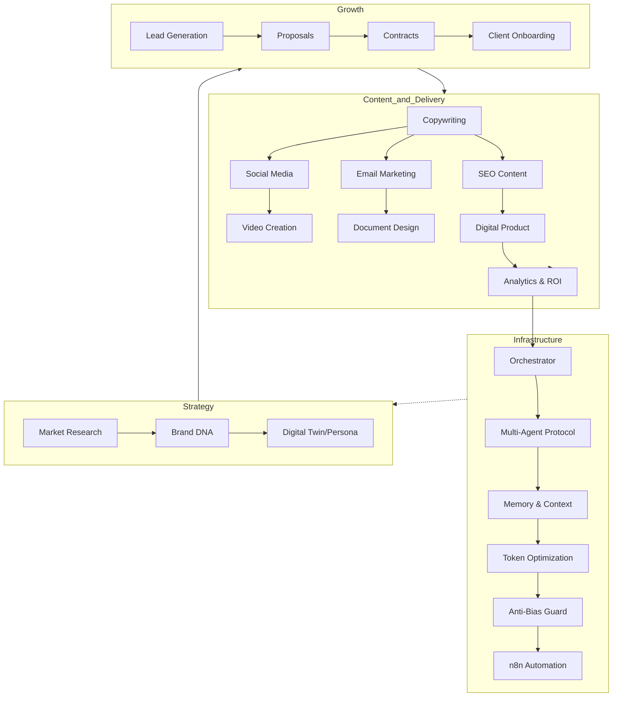

# 🚀 IDEALAB PARTNERS — Multi-Agent Claude Skills Ecosystem (v2.0)

[](https://anthropic.com/claude)
[](LICENSE)
[](CHANGELOG.md)

Transform Claude into a high-performance business department. This repository contains **22 specialized skills** that guide Claude (Claude.ai, Claude Code, or Claude API) to manage the entire lifecycle of a modern company with **10,000% modular logic**.

---

## 🗺️ The Full Business Circle (Architecture)



---

## 🧠 Why Use This?
Most agents fail because they lack structured logic. Our **v2.0 "Ontology First"** architecture gives Claude:
1. **Decision Context:** Every skill includes a logic map (Ontological Map).
2. **Quality Gates:** Built-in `anti-bias` and `token-optimization` skills.
3. **Claude Code Native:** Compatible with the latest Anthropic CLI and Marketplace.

---

## 🛠️ Installation & Usage

### ⚙️ Method 1: Claude Code (Recommended)
Automatically load all skills into your workspace:
```bash
# Clone the repo
git clone https://github.com/kenbenju/idealab-multiagent-skills.git

# Move skills to your project's .claude folder
mkdir -p .claude/skills
cp -r idealab-multiagent-skills/skills/* .claude/skills/
```

### 🌐 Method 2: Claude.ai (Web)
Compress any skill folder into a `.zip` and upload it to your Claude project or simply copy-paste the `SKILL.md` content into your project instructions.

---

## 🎬 Featured Skill: Video Creation v2.0
We've introduced a **Vector-First** architecture for video.
- Design storyboards with specific motion paths.
- Define modular visual assets (vectors) for editors.
- Build architectural briefs for AI video tools (Runway, Sora, Luma).
See [video-creation/SKILL.md](skills/video-creation/SKILL.md).

---

## 📂 Skill Catalog (22 Specialists)

| Category | Skills |
|:---|:---|
| **Core Admin** | `orchestrator`, `multi-agent`, `memory`, `token-optimization`, `anti-bias`, `n8n-workflows` |
| **Strategy** | `market-research`, `brand-dna`, `digital-twin` |
| **Sales** | `lead-generation`, `proposals`, `contracts`, `client-onboarding` |
| **Marketing** | `copywriting`, `email-marketing`, `social-media-design`, `seo-content`, `video-creation` |
| **Operations** | `digital-product`, `document-design`, `analytics-reporting` |

---

## 🤝 Contribution Policy (**Approval Required**)
We do **not** accept free-flow contributions. All changes must pass a rigorous audit by the **IDEALAB Core Team**.
1. Fork the repo.
2. Create your skill/update.
3. Submit a PR.
4. Wait for the audit and approval.
*Unauthorized merges are strictly prohibited.*

---

## 📜 License
Licensed under the **IDEALAB PARTNERS Custom Software License v2.0**. Personal use requires attribution; commercial use requires a dedicated partnership. See [LICENSE](LICENSE).

---

*© 2026 IDEALAB PARTNERS — Elevating Agentic Potential.*
