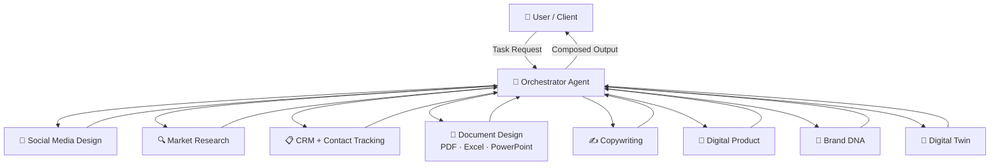

# 🧠 IDEALAB PARTNERS — Multi-Agent Orchestrator Skills

<div align="center">


**A production-ready library of AI multi-agent skills for digital marketing, brand strategy, and business intelligence.**

[🚀 Quick Start](#-quick-start) · [📚 Skills](#-skill-catalog) · [🤝 Contributing](CONTRIBUTING.md) · [📜 License](LICENSE)

</div>

---

## ✨ What is this?

`idealab-multiagent-skills` is an open skill library that powers **IDEALAB PARTNERS'** AI orchestration system. Each skill is a self-contained, versioned instruction set for an AI agent — covering everything from social media content creation to fully simulated digital twins of your customers.

The **Orchestrator Agent** routes incoming tasks to the right specialist agents, chains their outputs, and delivers a unified result — all with a human-centric tone.

---

## 🗺️ Architecture



---

## 📚 Skill Catalog

| # | Skill Folder | Description | Key Outputs |
|---|-------------|-------------|-------------|
| 1 | [`orchestrator`](skills/orchestrator/SKILL.md) | Routes tasks, manages state, composes final deliverable | Task routing map, composed report |
| 2 | [`social-media-design`](skills/social-media-design/SKILL.md) | Content calendars, captions, visual briefs by platform | 30-day calendar, caption sets, visual guide |
| 3 | [`market-research`](skills/market-research/SKILL.md) | Competitor analysis, trend mapping, ICP & SWOT | Research report, ICP card, SWOT matrix |
| 4 | [`crm`](skills/crm/SKILL.md) | Contact ingestion, interaction logs, pipeline & follow-ups | CRM record, pipeline stage, follow-up sequence |
| 5 | [`document-design`](skills/document-design/SKILL.md) | PDF reports, Excel dashboards, PowerPoint decks | Design brief + structured content |
| 6 | [`copywriting`](skills/copywriting/SKILL.md) | Sales pages, emails, ads — human tone & persuasion | Copy blocks, email sequences, ad variations |
| 7 | [`digital-product`](skills/digital-product/SKILL.md) | eBook, course, template pack, SaaS concept | Product spec, outline, pricing strategy |
| 8 | [`brand-dna`](skills/brand-dna/SKILL.md) | Mission, vision, voice, archetype, visual system | Brand DNA canvas, tone guide, visual system |
| 9 | [`digital-twin`](skills/digital-twin/SKILL.md) | Persona simulation, behavioral modeling, scenario testing | Persona profile, behavior map, scenario output |

---

## 🚀 Quick Start

### 1. Clone the repository

```bash
git clone https://github.com/idealab-partners/idealab-multiagent-skills.git
cd idealab-multiagent-skills
```

### 2. Choose a skill

Navigate to any skill folder and read the `SKILL.md`:

```bash
cat skills/orchestrator/SKILL.md
```

### 3. Invoke the skill in your AI system

Copy the instructions from `SKILL.md` into your AI agent system prompt or multi-agent framework (LangChain, CrewAI, AutoGen, Claude, GPT, etc.).

### 4. Run an example

```bash
cat skills/brand-dna/examples/example_01.md
```

---

## 📁 Repository Structure

```
idealab-multiagent-skills/
├── .github/
│   ├── ISSUE_TEMPLATE/
│   │   ├── bug_report.md
│   │   └── feature_request.md
│   └── PULL_REQUEST_TEMPLATE.md
├── skills/
│   ├── orchestrator/
│   ├── social-media-design/
│   ├── market-research/
│   ├── crm/
│   ├── document-design/
│   ├── copywriting/
│   ├── digital-product/
│   ├── brand-dna/
│   └── digital-twin/
├── LICENSE
├── README.md
├── CONTRIBUTING.md
├── CODE_OF_CONDUCT.md
├── SECURITY.md
└── CHANGELOG.md
```

---

## 🤝 Contributing

Contributions are welcome! Please read our [Contributing Guide](CONTRIBUTING.md) and [Code of Conduct](CODE_OF_CONDUCT.md) before submitting a pull request.

---

## 🔒 Security

Found a vulnerability? Please review our [Security Policy](SECURITY.md) and report it via email — **do not open a public issue**.

---

## 📜 License

This project is licensed under the **IDEALAB PARTNERS Software License v1.0**.  
See [LICENSE](LICENSE) for full terms.

Commercial use requires written permission from IDEALAB PARTNERS.

---

<div align="center">

Made with ❤️ by **IDEALAB PARTNERS**  
🌐 [idealabpartners.com](https://idealabpartners.com) · 📧 hello@idealabpartners.com

</div>
