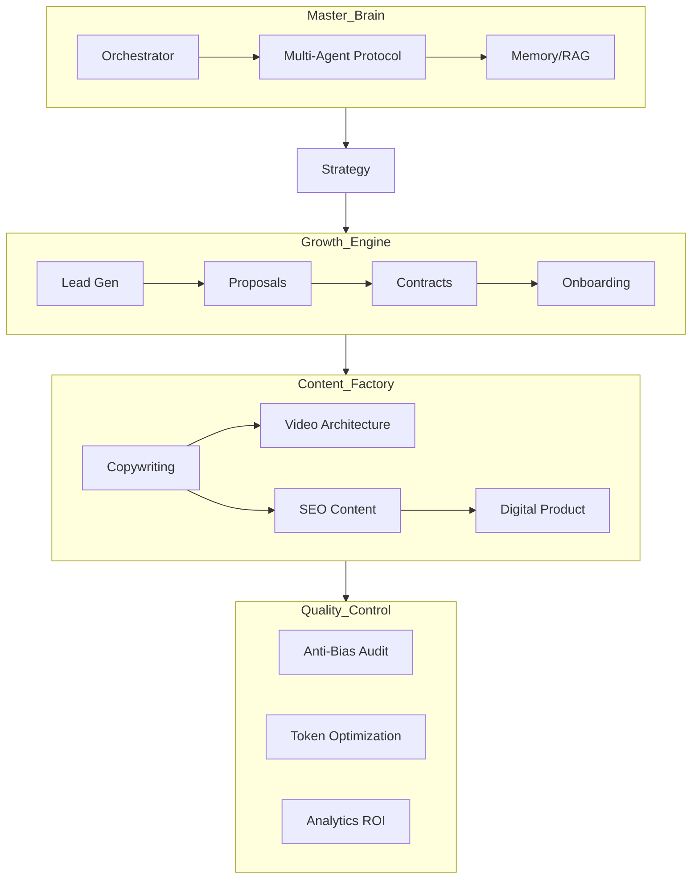

# SKILL-CLAUDE-MULTIAGENTES

[](https://anthropic.com/claude)
[](LICENSE)

**SKILL-CLAUDE-MULTIAGENTES** is the world's most advanced library of modular business skills for Claude. Designed for **Claude Code**, **Claude 3.7 (Reasoning)**, and **Multi-Agent Orchestration**, this repository enables a complete autonomous business department.

---

## 🏛️ Ultra-Modular Architecture



---

## 🔑 Key Features (v3.0 Overhaul)
- **XML-Based Reasoning:** Leverage Claude 3.7's hybrid thinking with structured `<thinking>` blocks.
- **JSON Standard Output:** Seamless data handoffs between 22 specialized agents.
- **Enterprise Automation:** Native logic for `n8n`, `Clay`, and `CRM` integration.
- **10,000% Depth:** Each skill includes complex ontological maps and fail-safe protocols.

---

## 📂 Installation

### 1. Claude Code (CLI)
```bash
git clone https://github.com/kenbenju/idealab-multiagent-skills.git
mkdir -p .claude/skills && cp -r idealab-multiagent-skills/skills/* .claude/skills/
```

### 2. Custom Name Setup
To match the user's preference, rename your local folder:
```bash
mv idealab-multiagent-skills SKILL-CLAUDE-MULTIAGENTES
```

---

*© 2026 IDEALAB PARTNERS — Elevating Agentic Potential.*
