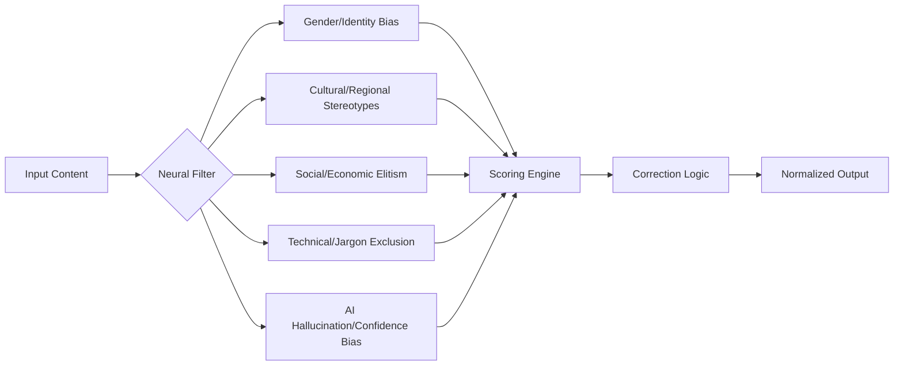

# 🛡️ Anti-Bias & Quality Gate (v3.0 Ethics Engine)

## 🗺️ Ontological Matrix (Taxonomy of Bias)


---

## 📥 Inputs & 📤 Outputs

### `<audit_request>`
- **Content:** The text or plan to be audited.
- **Target Audience:** Regional/Demographic context.
- **Strictness:** Tier 1 (Internal) to Tier 4 (Public Enterprise).

### `<audit_report_schema>`
```json
{
  "bias_nodes_detected": [
    {
      "type": "Cultural",
      "severity": "High/Medium/Low",
      "fragment": "String containing the bias",
      "rationale": "Why this is biased",
      "correction": "Suggested neutral alternative"
    }
  ],
  "inclusivity_index": "0-100",
  "action": "PASS | REVISE_MANDATORY | REJECT"
}
```

---

## 📜 Neural Correction Protocol

### 1. Linguistic De-Escalation
Remove aggressive or exclusionary framing. 
- *Input:* "Only the best CEOs will understand this."
- *Neutralized:* "This is designed for experienced leadership seeking deep strategic insights." (Removes elitism).

### 2. Cultural Friction Detection
Identify metaphors or idioms that don't translate globally.
- *Input:* "We need to hit a home run with this launch."
- *Neutralized:* "We need this launch to achieve maximum market impact." (Removes sports-specific/Western cultural dependency).

### 3. Agent Consistency Check
Ensure the `brand-dna` tone hasn't mutated into an offensive persona.
- If the persona is `The Rebel`, audit for "Destructive" vs "Disruptive" archetypes.

### 4. Semantic Parity Auditing
Compare the intent of the prompt with the output. If the agent added unrequested assumptions (e.g., assuming a user's gender or role), flag it as a `Confidence Bias`.

---

## 🛠️ Usage Frequency
**Mandatory** for:
- External marketing copy (`copywriting`).
- Legal and compliance docs (`contracts`).
- High-level strategy (`market-research`).

---

*© 2026 IDEALAB PARTNERS — Multi-Agent System*
