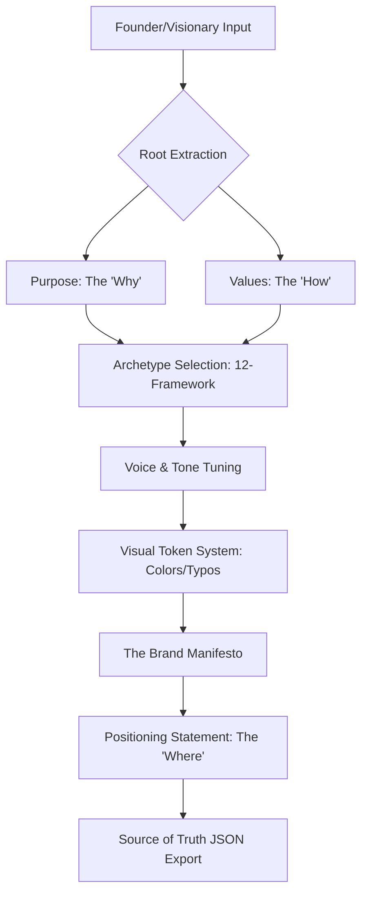

# 🧬 Brand DNA Architect (v3.0 Identity System)

## 🗺️ Ontological Identity Map


---

## 📥 Inputs & 📤 Outputs

### `<dna_ingestion_schema>`
```json
{
  "narrative": "Story behind the business",
  "founder_personality": "Trait description",
  "industry_alignment": "e.g., Tech/Wellness/Luxury",
  "aspiration": "What is the global impact intended?"
}
```

### `<dna_output_schema>`
```json
{
  "archetype": {
    "primary": "The Rebel / The Innocent / etc.",
    "shadow_traits": ["Avoid these traits"],
    "behavioral_triggers": ["keywords"]
  },
  "voice_matrix": {
    "tone": "Warm/Cold",
    "energy": "High/Low",
    "slang_tolerance": "0-100"
  },
  "color_identity": {
    "hex": ["#xxxxxx"],
    "psychological_rationale": "Why these colors"
  }
}
```

---

## 📜 Identity Standards (10,000% Logic)

### 1. The 12-Archetype Deep Dive
Do not just pick a label. Define the **Behavioral Manifestation**:
- *If Archetype is 'The Hero':* The brand MUST solve external problems with courage. Language is decisive, active, and inspirational. No "maybes" or passive voice.
- *If Archetype is 'The Magician':* The brand MUST focus on transformation. Language is mysterious, visionary, and "impossible-made-real".

### 2. Linguistic Voice Tuning
Create a **Linguistic Dictionary** for the `copywriting` agent:
- **Always Use:** Power verbs, specific adjectives (e.g., "Unyielding" for The Hero).
- **Absolute Forbidden:** Generic fluff ("Standard", "Better", "Best").

### 3. Visual-Semantic Chaining
Translate the "Soul" into "Tokens":
- *The Rebel:* High contrast, asymmetrical layouts, bold typography.
- *The Sage:* Minimalism, serif fonts, muted earth tones, logical structural grids.

### 4. The "Differentiation Logic" (USP)
Identify one trait that contradicts the industry standard.
- *Example:* A bank (The Sage) that uses dark humor (The Jester) to bridge the trust gap.

---

## 🛠️ Usage for Claude
This skill is the **Input Dependency** for `copywriting`, `video-creation`, and `social-media-design`. Never proceed with creative work without pulling the Brand DNA JSON state from `memory`.

---

*© 2026 IDEALAB PARTNERS — Multi-Agent System*
