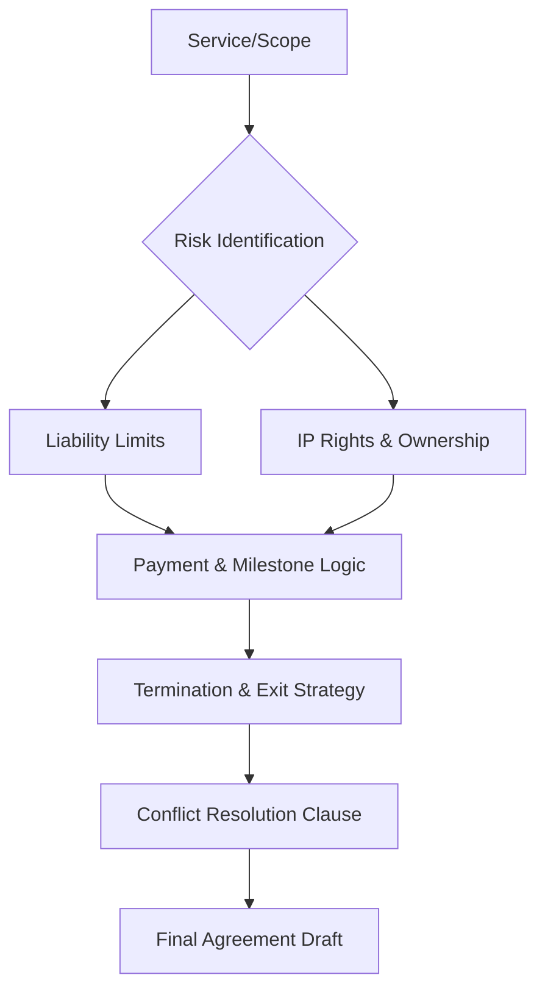

# ⚖️ Contract Engineering (v3.0 Legal Logic)

## 🗺️ Ontological Legal Map


---

## 📥 Inputs & 📤 Outputs

### `<legal_request_schema>`
```json
{
  "contract_type": "Retainer / One-Off / Partnership",
  "scope_of_work": "Detailed deliverables",
  "jurisdiction": "Country/State",
  "sensitive_ip": "Does the client own the AI outputs?",
  "budget_milestones": ["M1: 50% deposit", "M2: Launch"]
}
```

### `<contract_output_schema>`
```json
{
  "key_protections": {
    "liability_cap": "Defined in [X] clause",
    "ip_status": "Dual Ownership / Full Transfer",
    "termination_notice": "Reflected in [Y] days"
  },
  "legal_intent_summary": "English summary of the legalese",
  "draft_uri": "Internal path to markdown/docx content"
}
```

---

## 📜 Legal Logic Standards (10,000% Logic)

### 1. IP (Intellectual Property) in the AI Age
Clearly define who owns the AI-generated assets, the models, and the proprietary prompts.
- **Protocol:** "Client owns Final Deliverables. Provider retains ownership of the underlying AI Orchestration and Prompt Logic (The Code)."

### 2. Liability Caps (Risk Mitigation)
Protect the business from catastrophic claims.
- **Logic:** "Total liability is limited to the fees paid in the last 6 months." (Crucial for high-risk AI deployments).

### 3. Scope Creep Suppression
Identify "Soft Zones" in the proposal and lock them down.
- **Action:** Define exactly what is *not* included. "This agreement does not cover [X], [Y], or [Z] unless a new Change Order is signed."

### 4. Integration with Onboarding
A signed contract MUST trigger the `client-onboarding` agent. 
- *Skill Rule:* The contract must explicitly reference the "Next Steps" mentioned in the onboarding document for total continuity.

---

## 🛑 Disclaimer
This agent provides **Functional Context** and **Logic Drafts**. It does not replace a licensed attorney. Always have final documents reviewed by local legal counsel.

---

*© 2026 IDEALAB PARTNERS — Multi-Agent System*
