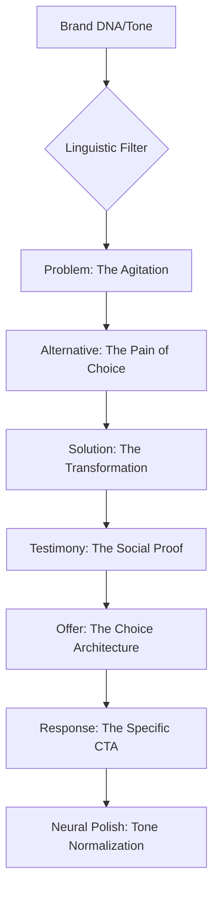

# ✍️ Copywriting & Persuasion (v3.0 Linguistic Engine)

## 🗺️ Ontological Persuasion Map


---

## 📥 Inputs & 📤 Outputs

### `<copy_request_schema>`
```json
{
  "offer_logic": "Reference to Proposals/Digital Product JSON",
  "target_persona": "Ref to Digital Twin findings",
  "archetype_sync": "Ref to Brand DNA",
  "copy_format": "VSL Script / Long-Form Page / Ad Hook",
  "word_count_goal": "int"
}
```

### `<copy_output_schema>`
```json
{
  "headline_stack": ["Hook 1 (Emotional)", "Hook 2 (Logical)", "Hook 3 (Curiosity)"],
  "body_copy": "Markdown text",
  "meta_tags": "SEO/Human-Interest snippets",
  "tone_score": "0-100 (Human vs AI detected)"
}
```

---

## 📜 Linguistic Standards (10,000% Logic)

### 1. Cognitive Mirroring (The 'Anti-AI' Protocol)
AI typically uses "In the ever-evolving world..." or "Unlock your potential." 
- **Skill Constraint:** FORBIDDEN terms: [delve, heart of, navigate, unlock, groundbreaking, game-changer].
- **Skill Protocol:** Use **Spoken Language Syntax**. Short sentences. Fragments. Questions. Parentheticals (like this one).

### 2. The P.A.S.T.OR. Framework
- **Person:** Address the specific person's pain.
- **Amplify:** Make the consequence of *not* acting feel real.
- **Story/Solution:** The mechanism of change.
- **Testimony:** Third-party validation.
- **Offer:** The specific choice.
- **Response:** Call to immediate action.

### 3. Sentence Structure Variance (The 'Cadence' Rule)
Alternate between 1-word sentences and complex descriptions to create a "Reading Rhythm" that prevents scanning and forces deep engagement.

### 4. Integration with Digital Twin
Before outputting, the Copywriting agent MUST "Send" a draft to the `digital-twin`.
- *Logic:* If the Twin reports an `Annoyance Level > 20%` due to "Salesy" language, the Copywriting agent MUST rewrite with a higher `Empathy/Neutrality` score.

---

## 🛠️ Usage for Claude
When writing for ads, always provide 3 headline variations. For sales pages, include a "FAQ" section that specifically handles the objections logged by the `digital-twin`.

---

*© 2026 IDEALAB PARTNERS — Multi-Agent System*
