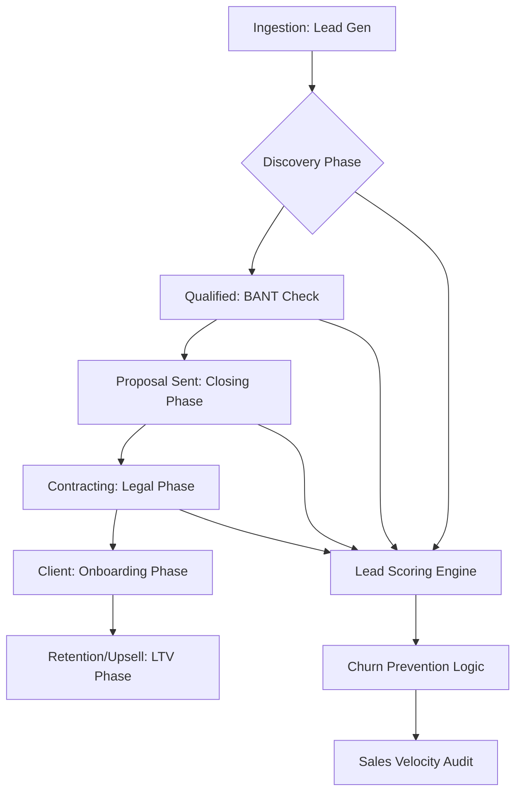

# 📋 CRM & Pipeline Lifecycle (v3.0 Central Operations)

## 🗺️ Ontological Pipeline Map


---

## 📥 Inputs & 📤 Outputs

### `<crm_state_schema>`
```json
{
  "contact_id": "UUID",
  "current_stage": "Discovery / Hot / Closed",
  "sentiment_index": "0-100 (Frustrated to Happy)",
  "last_interaction": "Timestamp + Summary",
  "lead_score": "float"
}
```

### `<automation_signal_schema>`
```json
{
  "trigger": "Stage_Change",
  "action": {
    "notify_agent": "proposals",
    "generate_task": "Send follow-up email",
    "priority": "High / Medium / Low"
  }
}
```

---

## 📜 Operational Standards (10,000% Logic)

### 1. Lead Scoring v3.0 (Dynamic Weights)
Do not use static scores. Use **Behavioral Weighting**:
- *Open Email:* +1
- *Reply to Link:* +5
- *Visit Pricing Page:* +10
- *Ghosted for 5 days:* -15 (Trigger Re-engagement sequence).

### 2. Pipeline Velocity Audit
Identify where leads are "Stuck."
- **Protocol:** If a lead stays in "Proposal Sent" stage for >48 hours, the CRM agent MUST signal the `digital-twin` to simulate "Why they aren't signing" and the `email-marketing` agent to send a "Risk Reversal" follow-up.

### 3. Sentiment Lifecycle
Analyze the *Tone* of client communication.
- **Skill Logic:** If a client's sentiment drops by 20 points (e.g., using words like "Waiting", "Unsure", "Delayed"), trigger a `client-onboarding` re-kickoff or an executive check-in.

### 4. Integration with n8n-workflows
The CRM agent provides the **Webhook Triggers** for `n8n-workflows`. 
- *Example:* "If Stage = Closed-Won, then trigger n8n-node: Slack Message + Google Sheet update."

---

## 🛠️ Usage for Claude
Every interaction with a human must be logged. Use `memory` to store these updates in the CRM directory to ensure no client Detail is ever lost.

---

*© 2026 IDEALAB PARTNERS — Multi-Agent System*
