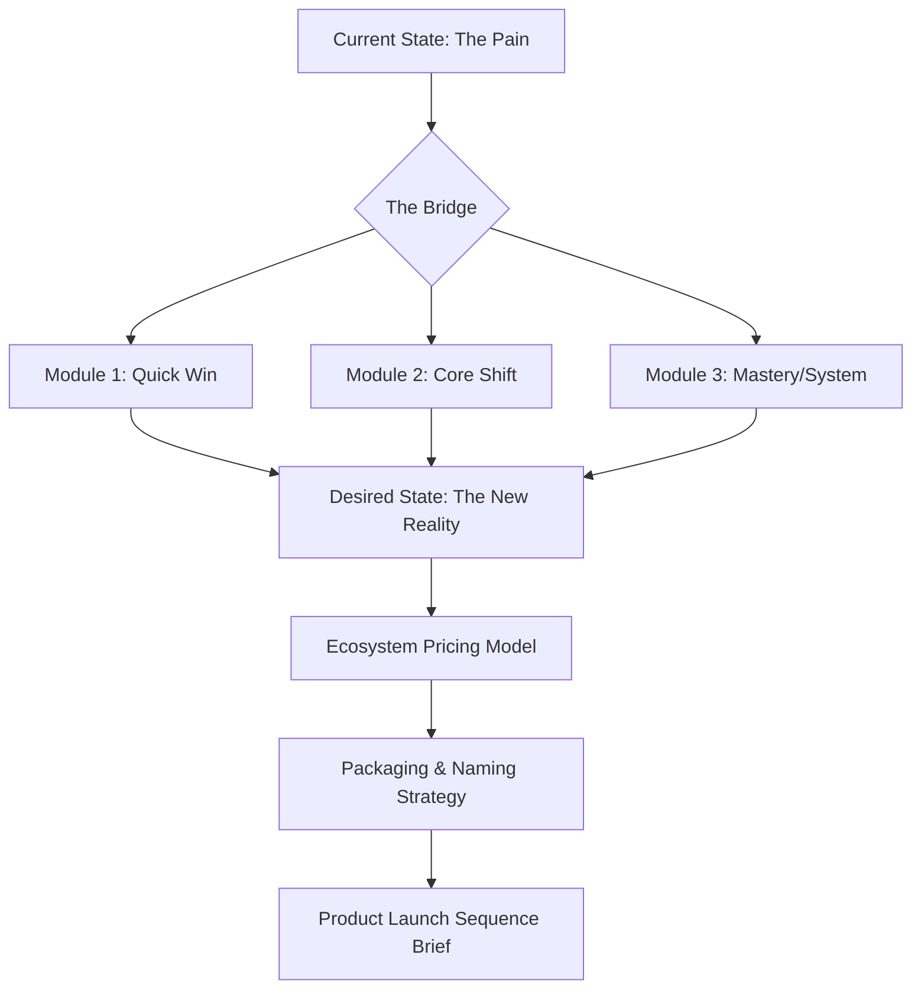

# 🚀 Digital Product Engineering (v3.0 Scalable Solutions)

## 🗺️ Ontological Transformation Map


---

## 📥 Inputs & Outputs

### `<product_spec_schema>`
```json
{
  "product_form": "eBook / Course / SaaS / Community",
  "primary_transformation": "e.g., Learn Python in 30 days",
  "price_point_logic": "High-Volume / Low-Volume",
  "recurring_revenue_node": "Subscription / Tiered Upsell"
}
```

### `<curriculum_output_schema>`
```json
{
  "module_blueprint": [
    {
      "module_name": "Phase 1: Foundation",
      "lesson_logic": ["Lesson 1: Intro", "Lesson 2: Setup"],
      "action_item": "Download the Checklist"
    }
  ],
  "naming_options": ["Direct", "Metric-Driven", "Metaphorical"],
  "pricing_tiers": {
    "self_study": "$X",
    "coached": "$Y",
    "done_for_you": "$Z"
  }
}
}
```

---

## 📜 Engineering Standards (10,000% Logic)

### 1. The Transformation Rule
Products fail because they sell "information." 
- **Skill Protocol:** Sell the **Result Gap**. Every module must answer: "How does this lesson move the user closer to [Desired State]?"

### 2. Ecosystem Pricing (The 'Laddder')
- **The Entry (Free/Low):** Lead Magnet or $7 Tripwire.
- **The Core ($97-$997):** The main transformation product.
- **The Backend ($2k+):** Coaching or SaaS subscription.
- **Logic:** Each stage must make the next stage feel like a logical "Next Step."

### 3. Naming Strategy (The 'Benefit' Test)
- **Weak Name:** "Introduction to AI."
- **10,000% Name:** "AI Profit System: Build your first autonomous agent in 4 hours."
- **Rule:** The name must contain either the **Timeframe** or the **Result**.

### 4. Integration with Marketing
Provide the `social-media-design` and `copywriting` agents with the `Transformation Map` JSON. 
- *Action:* The copy should focus on the "Pain of Module 0" versus the "Glory of Module 3."

---

## 🛠️ Usage for Claude
Use this skill to turn a general business idea into a "Buyable Asset." Collaborate with `memory` to ensure the product doesn't repeat content the client already has.

---

*© 2026 IDEALAB PARTNERS — Multi-Agent System*
