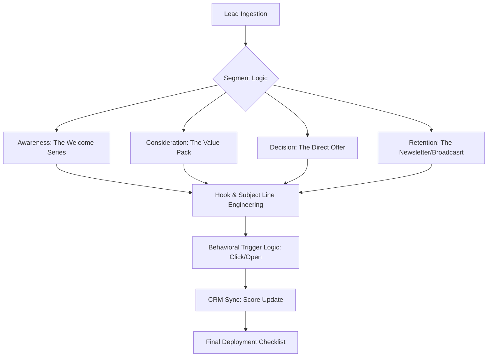

# 📧 Email Marketing & Nurturing (v3.0 Retention Engine)

## 🗺️ Ontological Nurture Map


---

## 📥 Inputs & 📤 Outputs

### `<email_campaign_schema>`
```json
{
  "sequence_type": "Indoctrination / Sales / Re-engagement",
  "num_emails": "int (e.g., 5-email Soap Opera)",
  "primary_cta": "Book Demo / Buy Link",
  "archetype_ref": "Brand DNA token",
  "segment_profile": "Ref to Digital Twin"
}
```

### `<email_output_schema>`
```json
{
  "sequence_plan": [
    {
      "day": 1,
      "subject_line": "Variable-Driven Hook",
      "body_logic": "Hook -> Story -> Bridge -> Offer",
      "behavioral_trigger": "Link Click -> Tag as 'Interested'"
    }
  ],
  "best_time_to_send": "Ref to Persona timezone",
  "spam_score_audit": "0-10 (Lower is better)"
}
```

---

## 📜 Retention Standards (10,000% Logic)

### 1. The Soap Opera Sequence (Storytelling First)
Do not send "Corporate News." 
- **Rule:** Every sequence must follow an **Open Loop** logic.
- *Email 1:* Set the stage/conflict.
- *Email 2:* High drama/The "Wall".
- *Email 3:* The Epiphany/The Solution.
- *Email 4:* Hidden benefits.
- *Email 5:* Direct Call to Action + Urgency.

### 2. Click-Propensity Hooking
Subject lines must bypass the "Promotion Tab" filters.
- **Protocol:** Use "Lowercase Logic" for human-looking emails.
- *Bad:* "SAVE 50% ON OUR NEW AI TOOL TODAY!"
- *10,000% Logic:* "question about your [Product] plan..."

### 3. Behavioral Trigger Logic
Email is a 2-way data stream.
- **Skill Action:** For every link, specify a **Tag Reward**. 
- *If user clicks 'Pricing':* Tag as `Warm Lead` and trigger the `lead-generation` sequence.

### 4. Integration with Copywriting
Use the `Sentence Structure Variance` rule from the `copywriting` agent. For mobile-first reading (80% of email), sentences must be under 15 words.

---

## 🛠️ Usage for Claude
Collaborate with `analytics-reporting` to analyze previous campaign performance (Open Rate/CTR) before drafting the next sequence.

---

*© 2026 IDEALAB PARTNERS — Multi-Agent System*
