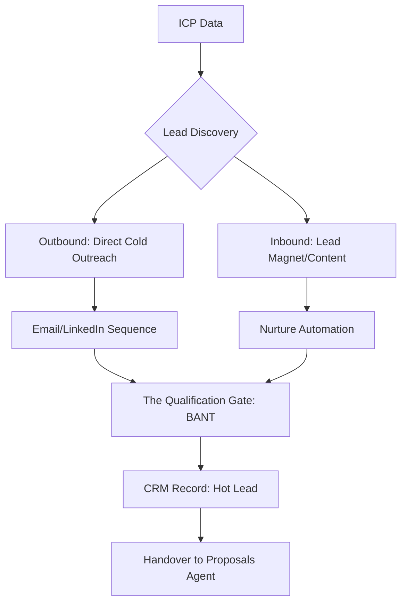

# 🎯 Lead Generation Engine (v3.0 Outbound Architect)

## 🏗️ Ontological Growth Map


---

## 📥 Inputs & 📤 Outputs

### `<prospect_ingestion_schema>`
```json
{
  "target_industry": "e.g., Tech Founders",
  "pain_point_trigger": "High churn rate",
  "data_sources": ["Clay", "Apollo", "LinkedIn"],
  "offer_hook": "Free AI Audit",
  "cta": "Book 15 min Call"
}
```

### `<sequence_output_schema>`
```json
{
  "sequence_structure": {
    "day_1": "Email 1: The Insight Hook",
    "day_3": "LinkedIn: The Soft Connection",
    "day_5": "Email 2: Value/Case Study",
    "day_10": "Breakup / Last Value Drop"
  },
  "enrichment_variables": ["First_Name", "Company_Mission", "Recent_Post_Topic"],
  "conversion_forecast": "0-100 (Historical Est)"
}
```

---

## 📜 Growth Standards (10,000% Logic)

### 1. The High-Fidelity Cold Email (Zero-Spam Logic)
Do not use generic "Hi [Name], I'd like to help you grow your business."
- **Logic:** Each email MUST include a `Relevance Node`.
- *Example:* "I saw your recent post about [Recent_Post_Topic] and noticed you are expanding into [Industry]. Based on our work with [Competitor], I built this brief [Free_Audit] for you."

### 2. BANT Qualification (Budget, Authority, Need, Timeline)
Lead generation is useless without quality.
- **Rule:** If the prospect is a "Freelancer" but the service is "$50k/month", trigger `memory` to flag as "Nurture Only (Low Priority)".
- **Rule:** If the prospect has the "Need" but no "Budget", pivot the offer to a `digital-product` (Lower ticket).

### 3. Lead Magnet Architecture (The 'Bridge' Logic)
A lead magnet must solve **One Specific Problem** in 5 minutes.
- *Instruction:* Design the magnet (PDF/Tool/Video) using `document-design` or `video-creation`.

### 4. Sequence Personalization (The Clay/Apollo Bridge)
Provide instructions for the `n8n-workflows` agent to pull dynamic variables from Apollo.io or Clay.com to inject into the `copywriting` templates.

---

## 🛠️ Usage for Claude
This skill depends on `market-research` (knowing who to target) and `brand-dna` (knowing how to sound). It feeds into `proposals` and `crm`.

---

*© 2026 IDEALAB PARTNERS — Multi-Agent System*
