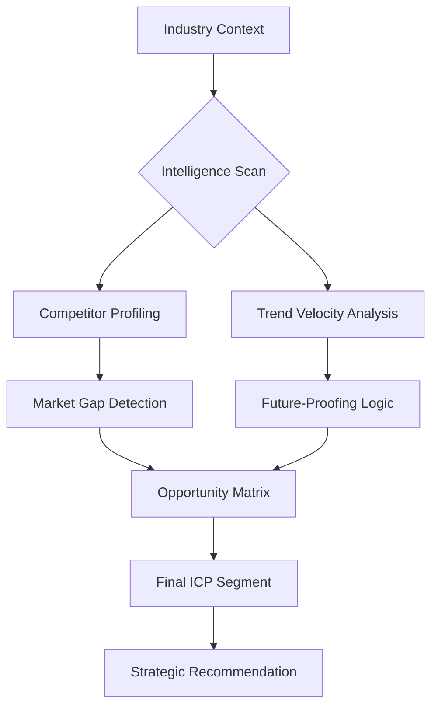

# 🔍 Market Research & Intel (v3.0 Strategic Scanning)

## 🏗️ Ontological Opportunity Map


---

## 📥 Inputs & 📤 Outputs

### `<intelligence_ingestion_schema>`
```json
{
  "target_industry": "e.g., Vertical AI for Law",
  "geographic_focus": ["Region 1", "Region 2"],
  "price_point_expected": "Low-Ticket / High-Ticket",
  "competitors_known": ["brand_a", "brand_b"]
}
```

### `<market_intel_schema>`
```json
{
  "competitor_analysis": [
    {
      "name": "brand_x",
      "moat": "What protects them?",
      "vulnerability": "Where they are bleeding?",
      "traffic_source": "Ad/SEO/Referral"
    }
  ],
  "market_gaps": ["Unmet need 1", "Unmet need 2"],
  "trend_velocity": "0-10 (Hyper-Growth vs Stagnant)",
  "sentiment_analysis": "Positive/Neutral/Aggressive"
}
```

---

## 📜 Competitive Intelligence Protocols (10,000% Logic)

### 1. Gap Detection Logic (The "Blue Ocean" Search)
Look for features or emotions that ALL major competitors are ignoring.
- *Logic:* "If Competitor A is Fast but Expensive, and Competitor B is Cheap but Slow, the Gap is in High-Speed Economy or Premium White-Glove."

### 2. SWOT Matrix (Dynamic Tiering)
- **Strengths:** Internal assets.
- **Weaknesses:** Internal friction.
- **Opportunities:** External changes (Legal, Tech, Social).
- **Threats:** External risks (New entrants, regulation).

### 3. ICP Evolution (Ideal Customer Profile)
Do not just provide demographics (Age/Location). Provide **Cognitive Triggers**:
- *Pain Point:* "Fear of falling behind in AI."
- *Secret Dream:* "To work 2 hours a day while their business grows on autopilot."
- *Objection:* "It sounds too complex to set up."

### 4. Trend Velocity Scanning
Identify if a trend is a **Fad** vs a **Structural Shift**. 
- *Skill Rule:* Only recommend structural shifts as foundations for `digital-product` or `seo-content`.

---

## 🛠️ Usage for Claude Code
When `Claude Code` has internet access, this agent MUST perform real-time searches via `search_web`. If offline, use historical `memory` or simulated `digital-twin` logic to predict market behavior.

---

*© 2026 IDEALAB PARTNERS — Multi-Agent System*
