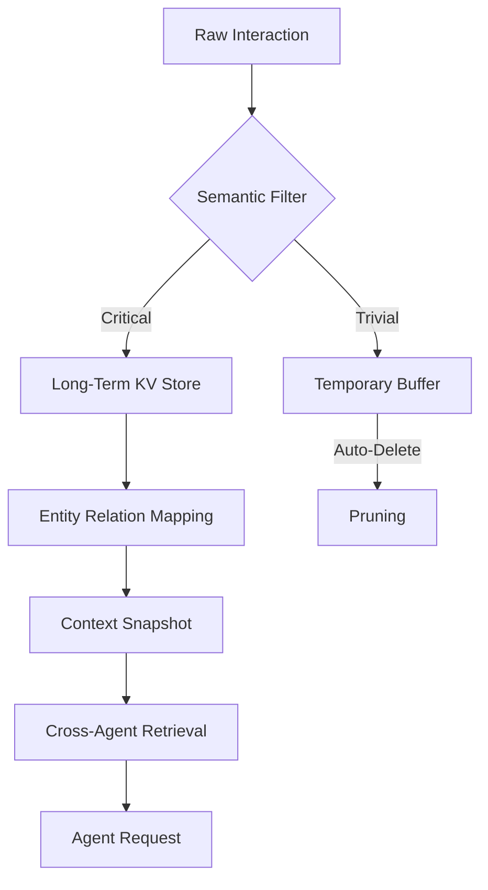

# 💾 Universal Memory & Context Logic (v3.0 RAG-Engine)

## 🏗️ Ontological Data Hierarchy


---

## 📥 Inputs & 📤 Outputs

### `<memory_read_schema>`
```json
{
  "query_scope": "Full / Modular / Entity-Specific",
  "project_id": "UUID / Project Name",
  "recall_depth": "Surface (Latest 3) / Deep (Entire History)",
  "semantic_filter": ["Keywords", "Roles"]
}
```

### `<memory_snapshot_schema>`
```json
{
  "snapshot_id": "system_generate_id",
  "context_vector": {
    "brand_dna": "current_state_ref",
    "market_gaps": ["gap1", "gap2"],
    "unresolved_tasks": ["task1"]
  },
  "compression_ratio": "0.X",
  "token_savings": "int"
}
```

---

## 🧠 Persistence & Retrieval Protocols

### 1. Semantic Mirroring
When an agent requests "Previous brand decisions," Memory must not just return text, but **Strategic Logic**:
- *Inefficient Recall:* "We decided on blue colors."
- *10,000% Logic Recall:* "Theme: Professional/Minimalist. Rationale: Archetype 'The Sage'. Primary: #0A192F. Avoid: Neon/Aggressive gradients."

### 2. Context Pruning (The 'Noise Killer')
To prevent "Context Drift" (where the LLM gets confused by old, irrelevant data), this skill automatically:
- Identifies redundant instructions.
- Summarizes solved problems into single-line "Truth Nodes".
- Drops low-score logic paths from the active window.

### 3. Cross-Agent Data Chaining
If `market-research` discovers a new competitor, Memory:
1. Updates the `Entity Relation Map`.
2. Signals `copywriting` that the "Differentiation" module needs an update.
3. Notifies `proposals` that a new objection has been added to the simulated `digital-twin`.

### 4. Encryption & Privacy Gate
Audit for Sensitive Data (PII). If a user provides a password or private financial data:
- **Rule:** Do not store in persistent memory.
- **Action:** Request a "Masked Alternative" from the user.

---

## 🛠️ Usage for Claude
Always call `memory` at the start of a `Claude Code` session. Use `ls -R` logic to find the latest snapshot files in the `.memory/` directory before proposing a path.

---

*© 2026 IDEALAB PARTNERS — Multi-Agent System*
