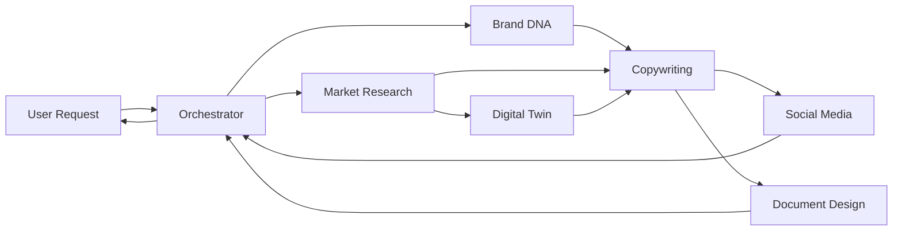

> [!NOTE]
> **Claude Usage** — Load this skill when you need to DESIGN how agents work together, not when routing a task. The Orchestrator skill handles task routing; this skill defines the underlying rules, protocols, and state schema those agents follow.

# 🕸️ Multi-Agent Collaboration Architecture

## Objective

Design the structural blueprint and communication rules for a system of Claude agents — including topology, message schemas, shared memory, handoff contracts, and error handling — so agents can be composed reliably and predictably.

---

## The Difference: Orchestrator vs. Multi-Agent Skill

| | Orchestrator Skill | Multi-Agent Skill |
|---|---|---|
| **Purpose** | Routes incoming tasks to agents | Defines HOW agents communicate |
| **Output** | `routing_plan`, `composed_output` | Communication protocol, topology diagram |
| **When to use** | An actual task needs to be done | Designing or debugging the agent system itself |
| **Analogy** | Traffic controller | Road designer |

---

## Step-by-Step Instructions

### Step 1 — Choose Agent Topology

Select the topology that matches the complexity of the workflow:

```
SEQUENTIAL (chain)
User → Agent A → Agent B → Agent C → Output
Best for: linear workflows where each output feeds the next.

PARALLEL (fan-out / fan-in)
User → Orchestrator → [Agent A, Agent B, Agent C] → Merger → Output
Best for: independent tasks that can run simultaneously.

HIERARCHICAL (supervisor)
User → Supervisor Agent
           ├── Sub-agent Team A
           └── Sub-agent Team B
Best for: complex projects with domain-specific teams.

MESH (peer-to-peer)
Agent A ↔ Agent B ↔ Agent C
Best for: collaborative refinement, adversarial review.
```

### Step 2 — Define the Shared Context Object
All agents share a mutable context object passed between calls:

```json
{
  "session_id": "IDEALAB-2026-001",
  "task_description": "...",
  "brand_context": {},
  "icp": {},
  "pipeline_stage": "brand-dna",
  "outputs": {
    "brand-dna": null,
    "market-research": null,
    "copywriting": null
  },
  "errors": [],
  "metadata": {
    "started_at": "2026-03-25T12:00:00Z",
    "tokens_used": 0,
    "agents_invoked": []
  }
}
```

### Step 3 — Define Agent Handoff Contracts
Each agent must declare:
- **Requires** (inputs it needs from context)
- **Produces** (outputs it writes to context)
- **Side effects** (external calls, file writes)

```yaml
agent: brand-dna
requires:
  - task_description
  - context.industry
  - context.target_audience (optional)
produces:
  - outputs.brand-dna.canvas
  - outputs.brand-dna.voice_guide
  - outputs.brand-dna.visual_system
side_effects: none
```

### Step 4 — Define Error Recovery Strategy

| Error Type | Recovery Action |
|-----------|----------------|
| Agent timeout | Retry once → use cached output → skip + flag |
| Missing required input | Block execution → request input from user |
| Output validation fail | Re-run agent with feedback prompt |
| Infinite loop detected | Break after 3 iterations → escalate to orchestrator |

### Step 5 — Token Budget Allocation
Assign token budgets per agent to prevent context overflow:

```
Total budget per session: 200,000 tokens (Claude 3.7 Sonnet)

Agent allocation:
- orchestrator:        5,000 (routing only)
- brand-dna:          15,000
- market-research:    20,000
- digital-twin:       15,000
- crm:                10,000
- copywriting:        20,000
- social-media:       15,000
- document-design:    10,000
- remaining agents:   5,000 each
- buffer:             25,000
```

### Step 6 — Draw the Topology Diagram
Produce a Mermaid diagram of the agent flow for this specific use case:



---

## Integration Points
- **Used by**: Orchestrator (follows protocols defined here)
- **Defines structure for**: All other skills
- **Connects to**: `memory` skill (shared state), `token-optimization` skill (budget management)

---

*© 2026 IDEALAB PARTNERS — For use with Claude (claude.ai) and Claude Code*
