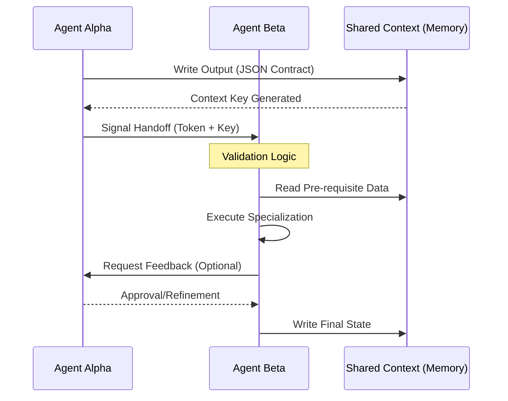

# 🤖 Multi-Agent Protocol (v3.0 Handoff Logic)

## 🗺️ Ontological Communication Map


---

## 📜 Handoff Contract Standards

All agents using this protocol MUST adhere to the following data structure for handoffs:

### `<handoff_schema>`
```json
{
  "sender_id": "string (e.g., brand-dna)",
  "receiver_id": "string (e.g., copywriting)",
  "payload": {
    "metadata": {
      "confidence_score": "0-1.0",
      "timestamp": "ISO-8601",
      "logic_version": "v3.0"
    },
    "data_stream": {
      "key_findings": ["item1", "item2"],
      "raw_values": {},
      "unresolved_edge_cases": ["item1"]
    }
  },
  "signal": "EXECUTE | REVISE | STANDBY"
}
```

---

## 🧠 Swarm Intelligence Logic

### 1. Peer Review Mode (Red-Teaming)
When two agents are tasks with a zero-failure objective (e.g., `contracts`), this skill forces a "Critique Loop":
- **Agent A (Draft):** Generates version 1.
- **Agent B (Audit):** Evaluates against `anti-bias` and `token-optimization`.
- **Iteration:** Only pushes to Orchestrator once Audit returns `status: clean`.

### 2. Context Chaining
Prevent context loss during deep workflows.
1. Each agent reads the `Global Context` from `memory`.
2. Agent appends its `Contribution Delta`.
3. Next agent performs a `Context Integrity Check` before proceeding.

### 3. Signaling Tokens
- `READY_FOR_SEQUENCING`: Task complete, move to next.
- `DATA_GAP_DETECTED`: Stop work, request user input.
- `HALLUCINATION_TRAP`: Internal logic mismatch, reset state.

---

## 🛠️ Usage for Claude
When coordinating multiple tools, CLAUDE must use this skill to document EXACTLY how one tool's output becomes the next tool's input. Do not assume continuity; establish it via the JSON Contract.

---

*© 2026 IDEALAB PARTNERS — Multi-Agent System*
