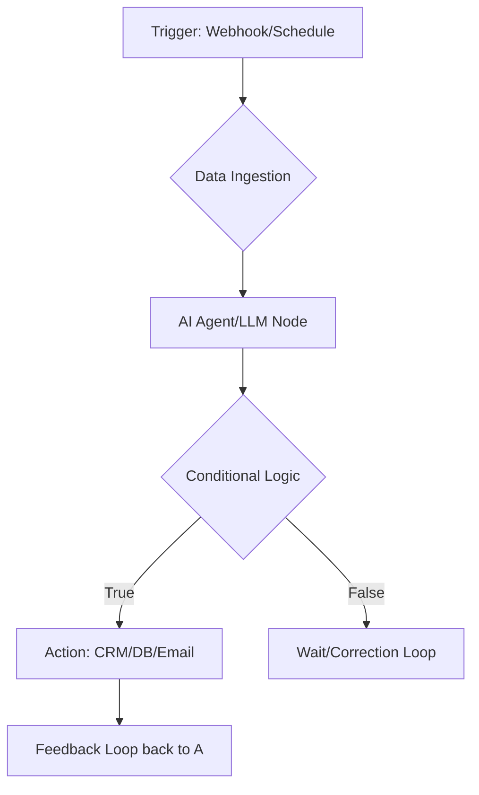

# 🕸️ n8n Enterprise Workflow Bridge (v3.0 Automation Architect)

## 🗺️ Ontological Automation Map


---

## 📥 Inputs & 📤 Outputs

### `<workflow_spec_schema>`
```json
{
  "automations_objective": "e.g., Cold Email Inbound Processing",
  "integration_points": ["Google Sheets", "Salesforce", "WhatsApp"],
  "security_tier": "API Key / OAuth2 / Local Tunnel",
  "performance_kpi": "Execution time < 5s"
}
```

### `<node_configuration_schema>`
```json
{
  "node_type": "n8n-nodes-base.httpRequest",
  "parameters": {
    "method": "POST",
    "url": "https://api.example.com/v1/",
    "authentication": "headerAuth",
    "bodyParameters": {
      "data": "={{ $json.content }}"
    }
  },
  "error_logic": "Retry on 429 after 30s"
}
```

---

## 📜 Automation Integrity Protocols

### 1. The "Wait Node" Strategy
Claude must design workflows that handle AI latency.
- **Protocol:** If the LLM node takes >10s (e.g., deep reasoning), use an asynchronous `Webhook Response` to acknowledge receipt before finishing the logic.

### 2. JSON Payload Mapping
Ensure data types match the destination.
- *Issue:* Sending a "String" to a "Date" field in CRM.
- *Skill Logic:* Use a `Map` node instruction to force format casting: `{{ new Date($json["created_at"]).toISOString() }}`.

### 3. Loop Protection
Prevent runaway credits.
- **Constraint:** All recursive loops must have a `max_iterations: 5` counter.

### 4. Claude-to-n8n Schema Parity
Ensure the Output of `copywriting` is mapped perfectly to an `Email` node.
1. Define the `Subject`, `Body`, and `Variables` in a JSON block.
2. Instruct the user to copy-paste this block into the n8n `Expression` field.

---

## 🛠️ Usage Hint
This skill is the "Hands" of the ecosystem. While other agents "Think", `n8n-workflows` implements the "Action".

---

*© 2026 IDEALAB PARTNERS — Multi-Agent System*
