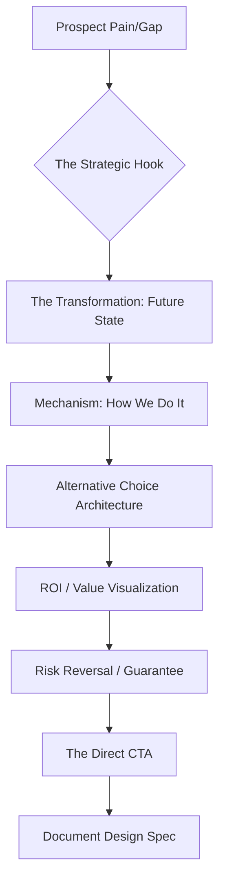

# 💼 Strategic Proposals & Pitches (v3.0 Closing Architect)

## 🏗️ Ontological Persuasion Map


---

## 📥 Inputs & 📤 Outputs

### `<proposal_ingestion_schema>`
```json
{
  "client_needs": ["need1", "need2"],
  "solution_details": "Core offer description",
  "investment_threshold": "Approx budget if known",
  "objections_predefined": ["objection1"],
  "competitor_context": ["comp1"]
}
```

### `<proposal_output_schema>`
```json
{
  "structure": {
    "slide_1": "The Problem Analysis (Urgency)",
    "slide_2": "The Big Promise (Result)",
    "slide_3": "Pricing - Tier 1, 2, 3",
    "slide_4": "Timeline & Next Steps"
  },
  "psychological_triggers": ["loss_aversion", "social_proof"],
  "roi_calculation_brief": "Draft of the value-added metrics"
}
```

---

## 📜 Closing Standards (10,000% Logic)

### 1. Alternative Choice Architecture (The 3-Price Tier)
Do not provide one price. Provide **Choice Logic**:
- **Tier 1 (Core):** Essential solution (Lowest Price).
- **Tier 2 (Pro):** Recommended / Highest Value (Medium Price).
- **Tier 3 (Elite):** High-touch / Premium (Highest Price - The Anchor).
- *Logic:* Tier 3 makes Tier 2 look cheap and Tier 1 look limited.

### 2. ROI Framing (Selling Outcomes)
Do not sell features. Sell **Return on Investment**:
- *Poor Framing:* "We provide AI automation services."
- *10,000% Logic:* "By automating [X] task, you save 40 hours/week, representing an annual saving of $[Amount], paying for the service in 3 months."

### 3. Risk Reversal Logic
Proposals die at the "risk" point.
- **Protocol:** Include a specific guarantee. "If [Result] is not met in [Time], we offer [Reversal/Refund/Pivot]."

### 4. Integration with Digital Twin
Run the finished proposal through the `digital-twin` agent. 
- *Skill Rule:* If the Twin reports `Skepticism > 40%`, the Proposal Agent MUST rewrite Slide 5 (Proof/Trust) and Slide 7 (Guarantee).

---

## 🛠️ Usage for Claude
Collaborate with `document-design` to ensure the proposal looks as premium as it sounds. Always reference the `brand-dna` for visual and linguistic consistency.

---

*© 2026 IDEALAB PARTNERS — Multi-Agent System*
