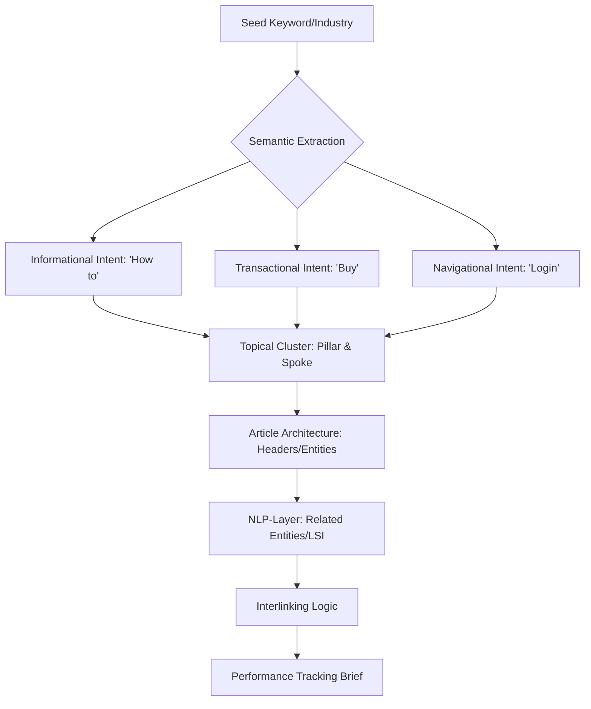

# 📈 SEO & Topical Authority (v3.0 Semantic Engine)

## 🗺️ Ontological Search Map


---

## 📥 Inputs & 📤 Outputs

### `<seo_request_schema>`
```json
{
  "seed_keyword": "e.g., AI Agents",
  "competitor_urls": ["url1", "url2"],
  "target_conversion": "Newsletter sign-up / Purchase",
  "existing_authority": "Low/Medium/High"
}
```

### `<seo_output_schema>`
```json
{
  "pillar_page": "The main comprehensive guide topic",
  "spoke_articles": ["Topic 1", "Topic 2", "Topic 3"],
  "entity_cloud": ["Entity 1", "Entity 2", "Entity 3"],
  "technical_brief": {
    "title_tag": "<155 chars",
    "meta_description": "<60 chars",
    "header_structure": ["H1", "H2", "H3"]
  }
}
```

---

## 📜 Semantic Standards (10,000% Logic)

### 1. Topical Authority (The 'Cluster' Logic)
Do not write one-off posts.
- **Rule:** You must own the **Topic**, not just the keyword. 
- **Protocol:** Generate 1 Pillar post (3,000 words) and 10 Spoke posts (1,000 words) that interlink to prove authority to search crawlers.

### 2. Intent Mapping (User Psychology)
- **Problem Aware:** "Why is my AI bill so high?"
- **Solution Aware:** "Best Claude token optimization tools."
- **Most Aware:** "SKILL-CLAUDE-MULTIAGENTES pricing."
- **Skill Task:** Map the correct CTA to each intent level.

### 3. NLP-Optimization (The 'Entity' Layer)
Search engines don't just read words; they read **Relationships**.
- *Example:* If writing about "Coffee," you MUST mention "Beans," "Roasting," "Café," and "Brewing." 
- **Instruction:** Use the `meram-search` results (if available) to identify the top 20 semantic entities used by top-ranking competitors.

### 4. Integration with Video-Creation
For every blog post, suggest a `Video Short` script. 
- *Logic:* Google favors pages with embedded video (Engagement + Dwell Time).

---

## 🛠️ Usage for Claude Code
Use `search_web` to find the current "Keyword Difficulty" and "Search Volume" before deciding on the cluster strategy.

---

*© 2026 IDEALAB PARTNERS — Multi-Agent System*
