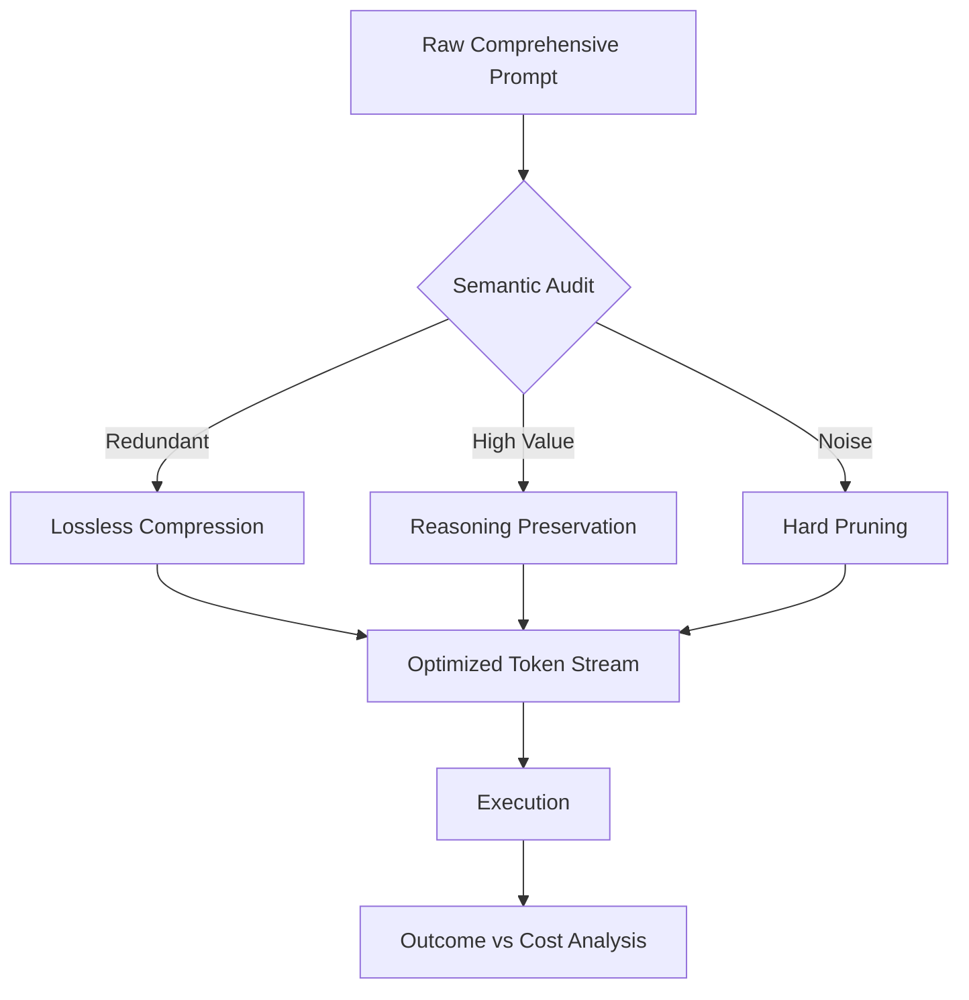

# 📉 Token Optimization & Budget Engine (v3.0 Semantic Compressor)

## 🗺️ Ontological Compression Map


---

## 📥 Inputs & 📤 Outputs

### `<optimization_request>`
- **Active Context:** Current prompt/history.
- **Goal:** Specific outcome required.
- **Threshold:** (e.g., "Max 4,000 tokens per agent").

### `<compression_log_schema>`
```json
{
  "original_token_count": "int",
  "optimized_token_count": "int",
  "reduction_percentage": "float",
  "logic_integrity_score": "0-1.0",
  "methods_applied": ["keyword_distillation", "template_merging"]
}
```

---

## 🧬 Efficiency Protocols

### 1. Keyword Distillation (Semantics First)
Instead of repetitive instructions, use **Linguistic Anchors**:
- *Verbose:* "Please ensure that you do not use any words that are common in AI writing like 'delve' or 'comprehensive'."
- *Optimized:* `Negative-Pattern: [ai-buzzwords]`.

### 2. Multi-Agent Batching
Minimize the "System Message Overload". If 3 agents share 80% of the same brand data:
1. Create a **Shared Context Anchor**.
2. Call sub-agents with **Delta-Instructions** only.

### 3. Pruning the "Thinking" Budget
Claude 3.7 reasoning can be token-heavy.
- **Rule:** For simple tasks (e.g., generating 3 hashtags), limit `extended-thinking` to `budget: 512 tokens`.
- **Rule:** For complex strategy (e.g., full product launch), allow `budget: 16k tokens`.

### 4. Summarization Recursing
Every 10 interaction turns, Memory and Token-Opt MUST collaborate to:
1. Summarize the path taken.
2. Drop all previous raw turns from the active buffer.
3. Preserve only the `State Vector`.

---

## 🛠️ Usage Strategy
This skill should be called by the `orchestrator` as a **Pre-Processor**. Every prompt sent to a specialist must pass through the `token-optimization` filter first.

---

*© 2026 IDEALAB PARTNERS — Multi-Agent System*
