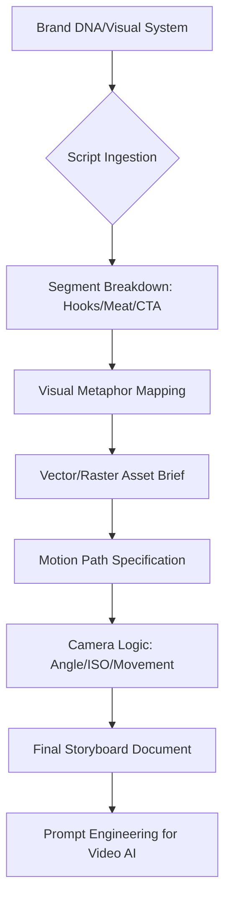

# 🎬 Video Creation & Motion Architecture (v3.0 Visual Engine)

## 🗺️ Ontological Cinematic Map


---

## 📥 Inputs & 📤 Outputs

### `<video_spec_schema>`
```json
{
  "video_type": "Explainer / Cinematic / YouTube / Ad",
  "duration_seconds": "int",
  "vibe": "Abstract / Realistic / High-End / Raw",
  "script_ref": "Reference to Copywriting JSON",
  "aspect_ratio": "9:16 / 16:9 / 1:1"
}
```

### `<storyboard_output_schema>`
```json
{
  "scenes": [
    {
      "time_start": "00:00",
      "visual": "Description of assets",
      "motion": "Camera zoom in + light pulse",
      "audio": "Text-to-speech or music style",
      "ai_tool_prompt": "Prompt for Runway/Luma"
    }
  ],
  "asset_inventory": ["Vector 1: Logo", "Vector 2: Background"],
  "color_hex_consistency": ["Ref from Brand DNA"]
}
```

---

## 📜 Visual Standards (10,000% Logic)

### 1. Vector-First Design
Do not just describe a "nice scene". Describe the **Layers**:
- *Background:* Deep blue Gaussian blur.
- *Midground:* Floating 3D Vector prism.
- *Foreground:* Dynamic typography (San-Serif).
- **Rule:** This allows an editor to swap assets without rebuilding the entire logic.

### 2. The 3-Second Hook Rule (Viral Mechanics)
- **Scene 1 (0-3s):** Must contain a "High Velocity" visual change or a "Pattern Interrupt". 
- *Skill Action:* Mandate a Camera Zoom or Lighting Shift in the first 100ms.

### 3. Camera & Motion Logic (For AI Precision)
When generating prompts for AI Video tools, use **Cinematic Specs**:
- *Camera:* 35mm lens, F1.4, handheld movement.
- *ISO:* 400 (Clean).
- *Motion:* "Orbital 360-degree rotation around the subject."

### 4. Integration with Brand DNA
The "Linguistic Voice" from Brand DNA must match the "Visual Velocity". 
- *The Rebel:* Fast cuts (0.5s), glitch effects, neon flashes.
- *The Sage:* Long slow pans (3-5s), minimalist transitions, clean white space.

---

## 🛠️ Usage for Claude
Collaborate with `copywriting` to ensure the audio-visual sync is accurate. If a script word is "BOOM", the Video Agent MUST specify a screen-flash or asset-pulse at that exact timestamp.

---

*© 2026 IDEALAB PARTNERS — Multi-Agent System*
